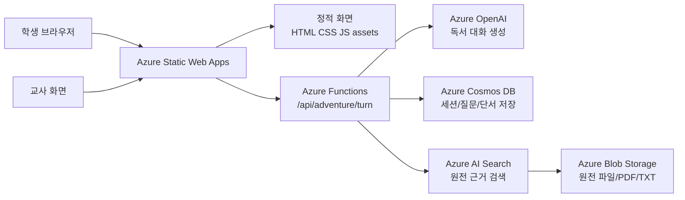

# BookAdventureProject Azure 완성본 로드맵

이 문서는 지금 폴더의 정적 MVP를 Azure 기반 실제 서비스로 키우기 위한 초보자용 진행표입니다.

## 1. 먼저 결론

현재 추천 배포 방향은 **Azure Static Web Apps + Azure Functions**입니다.

이유는 간단합니다.

- 지금 MVP는 이미 `index.html`, `style.css`, `app.js`, `assets`로 된 정적 웹앱입니다.
- 학생 화면은 정적 파일로 빠르게 배포하고, AI 질문 처리만 `/api`로 보내면 됩니다.
- Static Web Apps는 정적 파일 배포와 관리형 Azure Functions API를 한 프로젝트 안에서 다루기 좋습니다.
- 나중에 백엔드가 커지면 API 부분만 Azure App Service나 Container Apps로 옮길 수 있습니다.

`Azure App Service`가 더 맞는 경우도 있습니다.

- Node.js/Express 서버 하나가 HTML 화면까지 직접 제공해야 한다.
- 실시간 기능, 긴 작업, 서버 렌더링, 복잡한 관리자 기능을 한 서버에 묶고 싶다.
- Docker 컨테이너나 고정 서버 운영을 배워야 한다.

하지만 지금 단계에서는 App Service로 바로 가면 서버 구조를 새로 짜야 하므로, MVP 재사용성이 떨어집니다.  
따라서 **1차 완성본은 Static Web Apps + Functions**, 이후 필요하면 **API만 App Service로 승격**하는 길이 가장 부드럽습니다.

## 2. 완성본의 Azure 구조



초기에는 `Azure AI Search`와 `Blob Storage` 없이도 동작합니다.  
먼저 Azure OpenAI와 Cosmos DB를 붙이고, 책 원전이 많아지면 AI Search를 추가합니다.

## 3. 지금 코드에 추가된 연결점

- `agent-client.js`: 학생 화면에서 `/api/adventure/turn`, `/api/adventure/check-answer`를 호출합니다.
- `api/src/functions/adventure-turn.js`: 학생 질문에 대한 AI 답변 API입니다.
- `api/src/functions/check-answer.js`: 최종 정답 확인 API입니다.
- `api/src/functions/health.js`: Azure 배포 후 API가 살아 있는지 확인하는 API입니다.
- `api/src/shared/openai.js`: Azure OpenAI 연결 담당입니다.
- `api/src/shared/store.js`: Cosmos DB 저장 담당입니다.
- `staticwebapp.config.json`: Azure Static Web Apps 라우팅과 기본 보안 헤더입니다.

Azure 키가 없거나 AI 연결에 실패하면 예시 답변을 만들지 않고 재시도 안내를 표시합니다.

## 4. 초보자 단계별 만들기

### 1단계: GitHub 저장소 만들기

Azure Static Web Apps는 GitHub 또는 Azure DevOps와 연결해서 배포하는 흐름이 편합니다.

해야 할 일:

1. GitHub에 새 저장소를 만듭니다.
2. 이 폴더를 그 저장소에 올립니다.
3. `api/local.settings.json`이나 `.env` 같은 비밀 파일은 절대 올리지 않습니다.

### 2단계: Azure 리소스 그룹 만들기

Azure Portal에서 `Resource group`을 하나 만듭니다.

추천 이름:

```text
rg-book-adventure-dev
```

처음에는 개발용이므로 `dev`를 붙입니다.

### 3단계: Azure Static Web Apps 만들기

Azure Portal에서 `Static Web Apps`를 만듭니다.

입력 기준:

```text
App location: /
Api location: api
Output location: 비워두기
```

이 프로젝트는 빌드 과정이 없는 순수 HTML/CSS/JS 앱이므로 Output location을 비워도 됩니다.

### 4단계: 배포 확인하기

배포가 끝나면 두 주소를 확인합니다.

```text
https://배포주소/
https://배포주소/api/health
```

`/api/health`에서 `ok: true`가 보이면 프론트와 API 연결이 준비된 것입니다.

### 5단계: Azure OpenAI 연결하기

Azure OpenAI 또는 Azure AI Foundry에서 모델을 사용할 수 있게 준비한 뒤, Static Web Apps의 환경 변수에 다음 값을 넣습니다.

```text
AZURE_OPENAI_ENDPOINT=https://YOUR-RESOURCE.openai.azure.com
AZURE_OPENAI_API_KEY=YOUR-KEY
AZURE_OPENAI_MODEL=gpt-4o-mini
AZURE_OPENAI_API_VERSION=v1
```

모델 이름은 실제 배포한 모델 또는 사용 가능한 모델 이름과 맞춰야 합니다.

### 6단계: Cosmos DB 연결하기

학생의 질문, 답변, 정답 시도를 저장하려면 Cosmos DB for NoSQL을 만듭니다.

추천 구조:

```text
Database: bookAdventure
Container: adventureEvents
Partition key: /sessionId
```

Static Web Apps 환경 변수:

```text
COSMOS_ENDPOINT=https://YOUR-COSMOS.documents.azure.com:443/
COSMOS_KEY=YOUR-COSMOS-KEY
COSMOS_DATABASE_NAME=bookAdventure
COSMOS_CONTAINER_NAME=adventureEvents
```

### 7단계: 원전 근거 검색 붙이기

책 원문 파일이 늘어나면 Azure Blob Storage에 원문을 넣고, Azure AI Search로 검색 인덱스를 만듭니다.

이 단계가 들어가면 AI가 책 내용을 더 정확히 근거로 답할 수 있습니다.

추천 저장 구조:

```text
Blob container: book-sources
Search index: book-passages
Fields: bookId, title, passageText, chapter, page, sourceUrl
```

## 5. 로컬에서 연습 실행

프론트만 볼 때는 `index.html`을 브라우저로 열어도 됩니다.

API까지 로컬에서 보려면 다음이 필요합니다.

- Node.js
- Azure Functions Core Tools
- Azure Static Web Apps CLI

예상 흐름:

```powershell
cd api
npm install
Copy-Item local.settings.sample.json local.settings.json
npm start
```

전체 프론트와 API를 함께 보려면:

```powershell
swa start . --api-location api
```

AI 기능까지 확인하려면 Azure 키를 설정해야 합니다. 키가 없으면 `AI와 연결이 불안정합니다. 다시 시도해보세요.`라고 표시됩니다.

## 6. 완성본까지의 마일스톤

### M1. Azure 배포 가능한 MVP

- Static Web Apps 배포
- `/api/health` 확인
- 학생 화면에서 `/api/adventure/turn` 호출

### M2. 실제 AI 답변

- Azure OpenAI 연결
- 프롬프트 규칙 정리
- 메밀꽃 필 무렵 1권 기준으로 품질 확인

### M3. 저장되는 학습 기록

- Cosmos DB 연결
- 학생 세션, 질문, 발견 단서, 정답 시도 저장
- 교사용 확인 화면 준비

### M4. 원전 근거 기반 답변

- Blob Storage에 원문 저장
- Azure AI Search 인덱스 생성
- AI 답변에 근거 문단 연결

### M5. 교사용 완성 기능

- 책 추가/수정
- 학급 코드 또는 로그인
- 학생별 진행률
- 수업 후 활동지 출력

## 7. 지금 우리가 다음에 할 일

다음 작업은 `M1`입니다.

1. 현재 추가한 API 코드가 문법상 문제 없는지 확인합니다.
2. 정적 화면이 기존처럼 열리는지 확인합니다.
3. Azure 배포용 설정이 충분한지 점검합니다.
4. 그다음 실제 Azure Portal에서 Static Web Apps를 만들며 같이 따라갑니다.

## 참고 문서

- Azure Static Web Apps overview: https://learn.microsoft.com/en-us/azure/static-web-apps/overview
- Azure App Service overview: https://learn.microsoft.com/en-us/azure/app-service/overview
- Azure Functions Node.js developer guide: https://learn.microsoft.com/en-us/azure/azure-functions/functions-reference-node
- Azure OpenAI Chat REST reference: https://learn.microsoft.com/en-us/rest/api/microsoft-foundry/azureopenai/chat
- Azure Cosmos DB Node.js quickstart: https://learn.microsoft.com/en-us/azure/cosmos-db/quickstart-nodejs
- Azure AI Search overview: https://learn.microsoft.com/en-us/azure/search/search-what-is-azure-search
